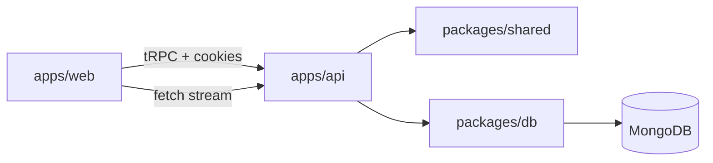

# Wortise — Chat con IA (prueba fullstack)

Monorepo **pnpm** + **Turborepo**: frontend **Vite/React** con **TanStack Router/Query/Form**, **HeroUI**, **tRPC** y **Better Auth**; backend **Bun-compatible (tsx)** con **Hono**, **tRPC**, **AI SDK** y **MongoDB** (driver nativo). Tipado fuerte con **Zod** en contratos compartidos.

## Stack

| Área        | Tecnología |
|------------|------------|
| Monorepo   | pnpm, Turborepo |
| Web        | Vite 6, React 19, TanStack Router/Query/Form, HeroUI, tRPC client |
| API        | Hono, tRPC, Better Auth, AI SDK, @ai-sdk/openai |
| Datos      | MongoDB (driver oficial), esquemas Zod en `@wortise/shared` |
| Auth       | Better Auth (email/contraseña), cookies de sesión |

## Arquitectura

- **`apps/web`**: UI, estado de servidor con TanStack Query, rutas `/auth` y `/chat`, query params `chatId` y `q` (búsqueda).
- **`apps/api`**: Hono monta Better Auth en `/api/auth/*`, tRPC en `/trpc`, streaming del asistente en `POST /api/chat/stream` (AI SDK `streamText` + tools).
- **`packages/shared`**: Schemas Zod (`MessagePart`, tools, inputs tRPC) — fuente de verdad de validación.
- **`packages/db`**: Repositorios Mongo, script de índices (`pnpm db:indexes`).



## Requisitos

- Node 20+ y pnpm 9+
- **MongoDB**: [Atlas](https://www.mongodb.com/atlas) (gratis) o **local** con [MongoDB Community Server](https://www.mongodb.com/try/download/community). URI típica local: `mongodb://127.0.0.1:27017/wortise`.
- **OpenAI** opcional: `OPENAI_API_KEY` (en producción sin clave podés usar `LLM_MOCK=1` para la demo).

## MongoDB y Vercel

**MongoDB no corre “dentro” de Vercel.** La base va en otro sitio; lo habitual es **[MongoDB Atlas](https://www.mongodb.com/atlas)** (tier gratis):

1. Creá un cluster en Atlas → **Database** → **Connect** → driver **Node.js**.
2. Copiá la connection string (con usuario y contraseña que definas en Atlas).
3. En **Network Access** permití `0.0.0.0/0` solo para pruebas, o la IP de tu hosting del API.

Esa URI va en **`MONGODB_URI`** del **servidor del API** (variables de entorno en Railway, Render, Fly.io, etc.), no hace falta ponerla en el front.

**Vercel** suele usarse para el **frontend estático** (`apps/web` tras `pnpm build`). El **API** (Hono + Node) es un proceso largo: muchos equipos lo despliegan en **Railway**, **Render** o **Fly.io** y en Vercel ponen `VITE_API_URL=https://tu-api...` para que el navegador llame al backend. Alternativa: un solo servicio en Railway con build del monorepo (web + API) si preferís un solo URL (requiere configurar el proxy o CORS).

Resumen: **Atlas = base de datos en la nube**; **Vercel = front** (típico); **API + `MONGODB_URI`** en otro host o en el mismo que el API.

## Setup local (sin Docker en el backend)

1. **Instalar dependencias** (en la raíz del repo):

   ```bash
   pnpm install
   ```

2. **Variables de entorno del API** — copia `apps/api/.env.example` a `apps/api/.env` y ajusta valores reales.

3. **Variables del web** (opcional) — `apps/web/.env.example` → `apps/web/.env`. En desarrollo con proxy de Vite puedes dejar `VITE_API_URL` vacío para que el navegador llame a `http://localhost:5173/trpc` y `http://localhost:5173/api/*` (proxy a `:3000`).

4. **Índices MongoDB**:

   ```bash
   pnpm db:indexes
   ```

   Requiere `MONGODB_URI` en el entorno (puedes exportarla o usar un `.env` cargado por tu shell; el script usa `process.env.MONGODB_URI`).

5. **Desarrollo** — API + web en paralelo:

   ```bash
   pnpm dev
   ```

   - API: `http://localhost:3000` (health: `GET /health`)
   - Web: `http://localhost:5173`

## Scripts (raíz)

| Script | Descripción |
|--------|-------------|
| `pnpm dev` | `turbo` en paralelo: `@wortise/api` y `@wortise/web` |
| `pnpm build` | Build de workspaces |
| `pnpm typecheck` | Typecheck vía turbo |
| `pnpm db:indexes` | Crea índices en MongoDB |

## Variables de entorno (API)

| Variable | Descripción |
|----------|-------------|
| `MONGODB_URI` | URI de conexión MongoDB |
| `BETTER_AUTH_SECRET` | Secreto largo (≥16 caracteres) |
| `BETTER_AUTH_URL` | URL base del API, p. ej. `http://localhost:3000` |
| `CORS_ORIGIN` | Origen del front, p. ej. `http://localhost:5173` |
| `OPENAI_API_KEY` | Clave OpenAI (opcional si `LLM_MOCK=1` en producción) |
| `OPENAI_MODEL` | Modelo (por defecto `gpt-4o-mini`) |
| `LLM_MOCK` | En producción: `1` = chat sin OpenAI (heurística + tools) |
| `WEATHER_USE_MOCK` | En dev, mock por defecto; `0` fuerza Open-Meteo |

## Flujo de autenticación

1. Registro/inicio con **Better Auth** (`/api/auth/*`).
2. Sesión por **cookie** httpOnly; el cliente usa `credentials: 'include'` en tRPC y en el stream.
3. En desarrollo, el front en `:5173` proxifica `/api` y `/trpc` hacia `:3000` para un solo origen en el navegador.

## Flujo de chat

1. Lista de chats: paginación por cursor (offset codificado en base64; documentado como trade-off).
2. URL `/chat?chatId=...&q=...`: chat activo y búsqueda por título.
3. Mensajes: partes tipadas (`text` | `tool_invocation`); resultados de tools **no** como texto plano del modelo — se persisten y se renderizan con tarjetas dedicadas.

## Sistema de tools

- Registro en servidor (`buildAiTools`): **fecha**, **hora**, **clima** (Open-Meteo + geocoding, sin API key; mock opcional en dev).
- Payloads discriminated union en Zod (`ToolResultPayload`).
- Extensión: añadir tool en `apps/api/src/ai/tools.ts`, entrada/salida Zod en `packages/shared`, renderer en `apps/web/src/components/message-parts.tsx`.

## Streaming

- **POST `/api/chat/stream`**: acepta cuerpo mínimo `{ chatId, text }` o el payload que envía **`useChat`** (`messages` + `chatId`).
- Respuesta en formato data stream del AI SDK (`toDataStreamResponse`).
- Tras finalizar, se actualiza el mensaje del asistente en MongoDB con `parts` definitivos.

## Persistencia

- Colecciones `chats` y `messages` (dominio propio); colecciones de usuario/sesión las gestiona Better Auth.
- Índices: ver script `packages/db/src/scripts/create-indexes.ts`.

## Workflow con IA (documentación honesta)

Herramientas de IA pueden usarse para scaffolding, borradores de README y exploración de APIs. La revisión de **auth/CORS**, **índices**, **modelo de `parts`** y **seguridad** debe ser humana. Esta entrega se implementó con asistencia de IA siguiendo el blueprint acordado; el código se validó con `pnpm exec tsc` en `apps/web` y `apps/api`.

## Modelos

- Por defecto: **OpenAI** `gpt-4o-mini` (configurable con `OPENAI_MODEL`).

## Trade-offs

- Paginación por **offset** en cursor para chats/mensajes: simple y suficiente para la prueba; a gran escala conviene keyset estable.
- Streaming en **ruta HTTP** dedicada en lugar de tRPC streaming: menos fricción con AI SDK y proxies.
- **Tailwind 3** con HeroUI (peer pide Tailwind 4): se mantiene por estabilidad; valorar upgrade cuando HeroUI lo exija.

## Mejoras futuras

- Keyset pagination, Atlas Search para título, tests e2e, rate limiting en stream, telemetría de tools.

## Licencia

Privado / prueba técnica.
