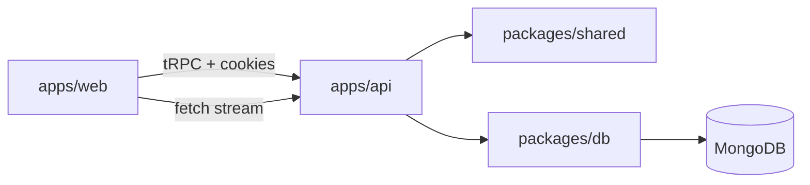

# Wortise — Chat con IA (prueba fullstack)

Monorepo **pnpm** + **Turborepo**: frontend **Vite/React** con **TanStack Router/Query/Form**, **HeroUI**, **tRPC** y **Better Auth**; backend **Bun-compatible (tsx)** con **Hono**, **tRPC**, **AI SDK** y **MongoDB** (driver nativo). Tipado fuerte con **Zod** en contratos compartidos.

## Stack

| Área        | Tecnología |
|------------|------------|
| Monorepo   | pnpm, Turborepo |
| Web        | Vite 6, React 19, TanStack Router/Query/Form, HeroUI, tRPC client |
| API        | Hono, tRPC, Better Auth, AI SDK, @ai-sdk/openai |
| Datos      | MongoDB (driver oficial), esquemas Zod en `@wortise/shared` |
| Auth       | Better Auth (email/contraseña), cookies de sesión |

## Arquitectura

- **`apps/web`**: UI, estado de servidor con TanStack Query, rutas `/auth` y `/chat`, query params `chatId` y `q` (búsqueda).
- **`apps/api`**: Hono monta Better Auth en `/api/auth/*`, tRPC en `/trpc`, streaming del asistente en `POST /api/chat/stream` (AI SDK `streamText` + tools).
- **`packages/shared`**: Schemas Zod (`MessagePart`, tools, inputs tRPC) — fuente de verdad de validación.
- **`packages/db`**: Repositorios Mongo, script de índices (`pnpm db:indexes`).



## Requisitos

- Node 20+ y pnpm 9+
- **MongoDB**: [Atlas](https://www.mongodb.com/atlas) (gratis) o **local** con [MongoDB Community Server](https://www.mongodb.com/try/download/community). URI típica local: `mongodb://127.0.0.1:27017/wortise`.
- **OpenAI** opcional: `OPENAI_API_KEY` (en producción sin clave podés usar `LLM_MOCK=1` para la demo).

## Setup local

1. **Instalar dependencias** (en la raíz del repo):

   ```bash
   pnpm install
   ```

2. **Variables de entorno del API** — copia `apps/api/.env.example` a `apps/api/.env` y ajusta valores reales.

3. **Variables del web** (opcional) — `apps/web/.env.example` → `apps/web/.env`. En desarrollo con proxy de Vite puedes dejar `VITE_API_URL` vacío para que el navegador llame a `http://localhost:5173/trpc` y `http://localhost:5173/api/*` (proxy a `:3000`).

4. **Índices MongoDB**:

   ```bash
   pnpm db:indexes
   ```

   Requiere `MONGODB_URI` en el entorno (puedes exportarla o usar un `.env` cargado por tu shell; el script usa `process.env.MONGODB_URI`).

5. **Desarrollo** — API + web en paralelo:

   ```bash
   pnpm dev
   ```

   - API: `http://localhost:3000` (health: `GET /health`)
   - Web: `http://localhost:5173`

## Scripts (raíz)

| Script | Descripción |
|--------|-------------|
| `pnpm dev` | `turbo` en paralelo: `@wortise/api` y `@wortise/web` |
| `pnpm build` | Build de workspaces |
| `pnpm typecheck` | Typecheck vía turbo |
| `pnpm db:indexes` | Crea índices en MongoDB |

## Variables de entorno (API)

| Variable | Descripción |
|----------|-------------|
| `MONGODB_URI` | URI de conexión MongoDB |
| `BETTER_AUTH_SECRET` | Secreto largo (≥16 caracteres) |
| `BETTER_AUTH_URL` | URL base del API, p. ej. `http://localhost:3000` |
| `CORS_ORIGIN` | Origen del front, p. ej. `http://localhost:5173` |
| `OPENAI_API_KEY` | Clave OpenAI (opcional si `LLM_MOCK=1` en producción) |
| `OPENAI_MODEL` | Modelo (por defecto `gpt-4o-mini`) |
| `LLM_MOCK` | En producción: `1` = chat sin OpenAI (heurística + tools) |
| `WEATHER_USE_MOCK` | En dev, mock por defecto; `0` fuerza Open-Meteo |

## Flujo de autenticación

1. Registro/inicio con **Better Auth** (`/api/auth/*`).
2. Sesión por **cookie** httpOnly; el cliente usa `credentials: 'include'` en tRPC y en el stream.
3. En desarrollo, el front en `:5173` proxifica `/api` y `/trpc` hacia `:3000` para un solo origen en el navegador.

## Flujo de chat

1. Lista de chats: paginación por cursor (offset codificado en base64; documentado como trade-off).
2. URL `/chat?chatId=...&q=...`: chat activo y búsqueda por título.
3. Mensajes: partes tipadas (`text` | `tool_invocation`); resultados de tools **no** como texto plano del modelo — se persisten y se renderizan con tarjetas dedicadas.

## Sistema de tools

- Registro en servidor (`buildAiTools`): **fecha**, **hora**, **clima** (Open-Meteo + geocoding, sin API key; mock opcional en dev).
- Payloads discriminated union en Zod (`ToolResultPayload`).
- Extensión: añadir tool en `apps/api/src/ai/tools.ts`, entrada/salida Zod en `packages/shared`, renderer en `apps/web/src/components/message-parts.tsx`.

## Streaming

- **POST `/api/chat/stream`**: acepta cuerpo mínimo `{ chatId, text }` o el payload que envía **`useChat`** (`messages` + `chatId`).
- Respuesta en formato data stream del AI SDK (`toDataStreamResponse`).
- Tras finalizar, se actualiza el mensaje del asistente en MongoDB con `parts` definitivos.

## Persistencia

- Colecciones `chats` y `messages` (dominio propio); colecciones de usuario/sesión las gestiona Better Auth.
- Índices: ver script `packages/db/src/scripts/create-indexes.ts`.

## Workflow de IA aplicado

### Resumen

Usé IA como apoyo en todo el ciclo (planificación, diseño, ejecución y review), con validación manual en decisiones críticas de arquitectura, dominio, persistencia, auth y streaming.

Principios aplicados:

- **La IA propone; yo valido.**
- **Primero arquitectura, luego scaffolding.**
- **No delegar sin revisión los límites de dominio/seguridad.**
- **Adaptar el código generado al contexto real del repo.**
- **Documentar el uso de IA de forma honesta y trazable.**

Flujo de trabajo seguido:

1. **Plan**: blueprint de monorepo, dominio, tools y estrategia de streaming.
2. **Diseño**: dirección visual y mockups antes de pulir UI.
3. **Build**: implementación por capas (auth, chats, mensajes, streaming, tools, UX).
4. **Review**: detección de riesgos técnicos y refinamiento final.

Delegado a IA (aceleración): desglose del challenge, propuestas de arquitectura, esqueletos de routers/schemas/componentes y borradores de documentación.

Validado manualmente (crítico): autorización por `userId`, modelo de chats/mensajes/parts, sincronización stream-DB, índices MongoDB, flujo real de Better Auth, URL state (`chatId`/`q`) y manejo de secretos.

### Prompting strategy

Estrategia por fases (no “hazme todo”): **plan → arquitectura → dominio → backend → frontend → mockup → ejecución → review**. Este orden redujo ruido y retrabajo.

---

### Prompts utilizados

#### 1. Prompt maestro para planificación y arquitectura

```text
Actúa como un Staff Engineer / Principal Fullstack Architect / Tech Lead con experiencia real construyendo productos SaaS modernos con TypeScript, AI SDK, Better Auth, tRPC, Bun, Hono, MongoDB, TanStack Router, TanStack Form, TanStack Query, HeroUI, Zod, pnpm y turborepo.

Necesito que me ayudes a resolver una prueba técnica fullstack senior de forma elite, con pensamiento arquitectónico, pragmatismo, mantenibilidad y foco absoluto en entregar una solución funcional, limpia, extensible y profesional.

Quiero que trabajes como si fueras:
- arquitecto de software
- reviewer técnico exigente
- senior product engineer
- senior UX/UI thinker
- copiloto de implementación

Tu objetivo es ayudarme a:
1. entender exactamente qué pide la prueba
2. diseñar la arquitectura ideal
3. diseñar el modelo de dominio
4. proponer la estructura del repositorio
5. definir el flujo de implementación
6. diseñar la UI y el mockup
7. generar una estrategia de desarrollo paso a paso
8. detectar riesgos y anti-patrones
9. ayudarme a redactar un README elite
10. asegurar que todo sea fácilmente ejecutable en local

Quiero una propuesta concreta, bien pensada, de nivel elite, para usarla como blueprint real de implementación.
```

#### 2. Prompt para estructura de monorepo

```text
Diseña la estructura ideal de monorepo para esta prueba técnica usando turborepo + pnpm con:
- apps/web
- apps/api
- packages/shared
- packages/db

Necesito:
- árbol de carpetas
- responsabilidades de cada capa
- qué schemas y tipos viven en shared
- qué vive en db
- cómo mantener tipado end-to-end
- cómo evitar acoplamiento
- scripts recomendados de desarrollo, build y typecheck
```

#### 3. Prompt para modelado de dominio

```text
Actúa como arquitecto de dominio senior.

Necesito modelar una app de chat con:
- usuarios autenticados
- múltiples chats por usuario
- mensajes persistidos
- búsqueda por título
- chats pineados
- streaming
- tools reales con outputs tipados

Diseña:
- entidades
- tipos TypeScript
- Zod schemas
- documentos MongoDB
- índices
- estrategia recomendada para MessagePart
- cómo representar tool invocations y tool results
- cómo mantener extensibilidad futura
```

#### 4. Prompt para tools tipadas

```text
Diseña una arquitectura extensible para tools del agente.

Tools mínimas:
- currentDate
- currentTime
- currentWeather

Quiero:
- ToolDefinition
- ToolContext
- ToolPayloadMap
- registry tipado
- input/output schemas con Zod
- estrategia para renderers en frontend
- separación entre texto y resultados estructurados
- provider desacoplado para clima
```

#### 5. Prompt para streaming

```text
Actúa como senior backend architect.

Necesito una estrategia pragmática para manejar streaming de mensajes del asistente con AI SDK.

Explica:
- cómo inicia el envío
- cómo viaja el stream
- cómo se representa en frontend
- cómo persistir el mensaje final
- cómo integrar tool calls y tool results
- cómo evitar inconsistencias entre stream y DB
- qué camino recomiendas para una prueba técnica y por qué
```

#### 6. Prompt para backend

```text
Actúa como Staff Backend Engineer.

Diseña el backend con Bun + Hono + tRPC + MongoDB para una app con:
- Better Auth
- list/create/rename/pin/delete chats
- list messages by chat
- chat streaming endpoint
- tools tipadas
- autorización por usuario

Quiero:
- routers
- procedures
- services
- repositories
- validaciones Zod
- middlewares
- manejo de errores
- índices relevantes
- riesgos técnicos
```

#### 7. Prompt para frontend

```text
Actúa como Senior Frontend Architect.

Diseña el frontend con TanStack Router, Query, Form y HeroUI para:
- /auth
- /chat

Necesito:
- estructura por features
- manejo de URL state
- manejo de server state
- loading/error/empty states
- chat list con búsqueda e infinite scroll
- message list
- tool cards
- composer
- streaming UX
- recomendaciones implementables y limpias
```

#### 8. Prompt para diseño visual y mockup

```text
Actúa como Principal Product Designer especializado en SaaS modernas, asistentes de IA y productos B2B.

Necesito una propuesta visual premium, sobria, moderna, implementable y realista para una app con:
- pantalla /auth
- pantalla /chat
- sidebar con chats recientes
- búsqueda
- chats pineados
- rename/pin/delete
- conversation view
- streaming state
- cards específicas para date/time/weather tools

Inspiración sutil:
- ChatGPT
- Claude
- Linear
- Notion
- Vercel

Quiero:
- layout general
- jerarquía visual
- componentes principales
- estados loading/error/empty
- tokens visuales
- paleta
- tipografía
- spacing
- recomendaciones para HeroUI
- un prompt final para generar el mockup high fidelity
```

#### 9. Prompt para review técnico final

```text
Actúa como reviewer senior de una empresa top.

Voy a pasarte archivos y decisiones de una prueba técnica fullstack senior.

Tu tarea:
- detectar problemas de arquitectura
- detectar tipado débil
- detectar acoplamientos innecesarios
- detectar riesgos de escalabilidad
- detectar anti-patrones
- proponer mejoras concretas

Clasifica todo en:
1. critical
2. important
3. nice to have
```

#### 10. Prompt para README final

```text
Ayúdame a redactar un README.md elite para una prueba técnica fullstack senior.

Debe incluir:
- overview
- stack
- arquitectura
- setup local
- variables de entorno
- auth flow
- chat flow
- tools architecture
- streaming
- decisiones técnicas
- workflow con IA
- prompts utilizados
- modelos utilizados
- trade-offs
- mejoras futuras
```

---

### Modelos y herramientas usadas (desarrollo del proyecto)

- **ChatGPT Thinking**: análisis del challenge, planificación, arquitectura y revisión de riesgos.
- **Claude**: expansión de arquitectura, diseño visual/mockups y apoyo en implementación.
- **Claude Agents**: ejecución acelerada de tareas concretas sobre el plan definido.

### Conclusión

La IA se usó como multiplicador de velocidad y claridad, con revisión manual en todas las decisiones sensibles para mantener coherencia, seguridad y mantenibilidad.

## Modelos (runtime del chat)

- Por defecto: **OpenAI** `gpt-4o-mini` (configurable con `OPENAI_MODEL`).

## Trade-offs

- Paginación por **offset** en cursor para chats/mensajes: simple y suficiente para la prueba; a gran escala conviene keyset estable.
- Streaming en **ruta HTTP** dedicada en lugar de tRPC streaming: menos fricción con AI SDK y proxies.
- **Tailwind 3** con HeroUI (peer pide Tailwind 4): se mantiene por estabilidad; valorar upgrade cuando HeroUI lo exija.

## Mejoras futuras

- Keyset pagination, Atlas Search para título, tests e2e, rate limiting en stream, telemetría de tools.

## Licencia

Privado / prueba técnica.
